Issues:
displaying manytomany fields in html, fixed with all. 
manytomany field in admin when adding movie, fixed with horizonal filter

approve review when there is not text, only rating, so it is added right away and calculated in the average. So I want a conditional default value of the approved field, a simple if else statement. I had trouble finding the answer to this, but then I found https://stackoverflow.com/questions/12649659/how-to-set-a-django-model-fields-default-value-to-a-function-call-callable-e/15289517. It did not work, and I tried different places to put the code, below, above, inside the review model. But I read that the field itself cannot have if statement, so I thought it should be a callable. 

But I tried something else instead.

So I added it in the view before the review is saved to the database. Now it sets approved to True when both title and text are empty, and it displays an appropriate message and the rating is visible and calculated into the average right away. And when title and text are not empty, it needs to be approved. When I add a review with empty title and text in admin, it does not get approved right away, which I think is not a relevant issue as the superuser can just approve it.
Because of the null=True, the None got visible as a title in the frontend, so in the template, I had to add another if statement to only display the title if it is not empty

In admin when title is empty, you cannot click it to approve. So when title is empty but there is text, you cannot approve it. Do I change to title being mandatory? Could make sense. But I can also custumise admin, by setting changing the str method on the model so it represented as a link in the list display in admin, and editable. But that turned out has no effect when there is list_display. So i tried to set a title value before it's saves in the views.py, but that did not work for when you add a space in the title.
Also when you just add a space, it does not need to be approved. Very good. But then the title is not clickable in amdin, because it does not change to 'open'. I could have ofcourse added that to the condition, but I thought there should be a better way. I realised that I needed to add null=True (now it just had blank=True) to the title field (or I tested out lots of stuff at this point, https://medium.com/techtrends-digest/what-is-the-difference-between-null-true-and-blank-true-in-django-3b49be024ec5), so that I can have title as the clickable link in admin, since that is good when there is a title, and this null=True also fixed that empty titles are dspalyed as -, which is good enough since it is clickable so the superuser can edit it. 

Minor issue, after sending first rating which is approved right away, the total at the top is 0 althought the average is updated. After updating page it is fixed. Deleting a review affects both right away, so I should implement something like that with url?

Editing reviews
I found that my form fields had the same id to all 3 of my form fields, and this hinders the edit functionality because the user should be able to update all three fields, so I should be able access the fields separately. Also, it is not good html. So I needed to fix this. I thought i was because of crispy, but it was just in the template.
Editing the rating field was harder, as the selected option did not render in the form after clicking Edit. I needed to access it in a different way than usual, because it is "Rating {{review.rating}}" in the template, and in devtools it says "Rating: 4" in plain text, so how to access the 4? 

I used print statements to see what values my variables actually got, since they are different form the actual reviews that users left, and the form when you fill it in.

In this construction, the rating number is always the last character of the string, so I took help from this source https://javascript.plainenglish.io/javascript-get-last-character-of-string-4a7ac4d52bea, and fetched the number from the string that way. Then, I found selectedIndex on stackoverflow and set the selectedIndex of the rating field at the rating number plus 1, so I would get the correct value on the field, since index[1] corresponds with a rating of 0, and so forth. 

However, the rating was not changed but there was a new rating coming. I have to fix this.. Fixed now don't know what happened, maybe I was inpacient and pressed several times.
Sometimes edit does not work, submit does not change to update on reviews with only a rating. This is becaus of JS I assume, since I am collecting content that is not there. I also get an error like this in the console, that it "cannot read properties of null". So I added javascript if statements to evaluate these fields only if they are not empty in the current review. This worked. I was surprised it worked, I thought maybe then you cannot add a title and text to a current review that had none, but it still worked. I guess the rest is handled by the view and works as normal as though you would submit a new review.

Also, when you want to edit a review with title and text, and remove title and text so there is only a rating left, and you submit it, it needs to be approved. This should not happen. I need to adjust the "if review_form.is_valid() and review.author == request.user:" in the edit_review view corresponding to the code in the movie_detail view. So I added an if else statement to set approved to True if there is no title are text in the new review, and otherwise approved is set to false. I also adapted the message to the two different situations for clearer feedback to the user.

Admin
Search fields some issues creating the right code in admin.py for the search fields when they are foreignkey or manytomany. Fixed with https://docs.djangoproject.com/en/5.2/ref/contrib/admin/#django.contrib.admin.ModelAdmin.search_fields.

Security
I got a GitHub warning about gunicorn and needed to upgrade to a higher version than CIs walkthrough.

Issue that took longer time
Getting the average rating in my home screen. I had it in my movie_detail sceen and view, so I looked for a way of getting that exact value for the index.html template, without adding it to my view for the index.html. I found articles about context processors, and some other concepts, but they seemed too complicated for such an easy thing. Then I read through this post https://forum.djangoproject.com/t/aggregate-an-average-from-two-fields-from-separate-models/19705/2, and I realised I was wrong all along, I should have added my calculation of averages in the Movie model as a method, so then I can use that in all my templates based on my Movie model. So I did that, and it worked. I also read that .count can be used directly in the template instead of adding it as a variable in the view, so I did that, and on some forum someone said that rounding to two decimals is best done in the template to avoid calculation errors, so I did that with |floatformat:2.https://www.reddit.com/r/djangolearning/comments/jtvbxn/rounding_an_aggregation_to_2_decimal_places/. The good thing is now I could also easily add it to my search results list.

Design of index page
I wanted to add something so that the index is not just a list of movies. Other movie websites have several blocks with content or images and genre based rows. So to add something extra to the home page, I decided to create a feature with top picks by the superuser. The superuser can change those whenever so other movies get the spot. This would actually need a bit more background information on this website since it becomes personalised, so for now I can add this in the footer.

To only dispaly the top pics on the first page was more difficult than I thought it would be, I could not use a simple "if page does not have prev" condition, which is the same as the first page. Then I found that I could use the variable page_obj.number and used "page_obj.number == 1" as a condition to only display the top pics on the first page. But, the pagination also affected the top pics, so I needed to fix that pagination would only affect the all movies section.

I found a way to put hte logic in the view and add two different querysets to the class based view of index.html, with post from Pran Kumar Sarkar in: https://stackoverflow.com/questions/48872380/display-multiple-queryset-in-list-view
I used this to create a queryset for all published movies, and one for all published movies with top_pick selected. And by adding the [:3] it was easy to just get 3 movies. 
Now I just had to fix the pagination issue.
With the solution of two querysets for the ListView, paginate_by raised an error so I needed to check a different way to paginate. I checked similar issues on the internet and realised it has to do with me having two dictionaries in my queryset, so it does not know which queryset to paginate. Here it says I should use another method: https://stackoverflow.com/questions/60560493/django-listview-pagination-when-passing-multiple-objects-in-queryset and I also found it in the django doc that that is better to do, so I have to change it. 
After changing it and redoing the html template tags, it worked to paginate. Now, it also worked to have the condition of if page_obj.number == 1 % in my template, so the top picks only appear on the first page. The [:3] worked for this context override as well, so I kept that to only fetch 3 top picks. 

I have also decided that it makes more sense to display the top pick motivation belonging to the movie, so I added a text field to the model allowing the superuser to write a text (max 300 characters) for the top pick motivation, and if the field is not empty, display it in the index html in the top pic section. 

Only 1 review per user

I found a useful post (https://stackoverflow.com/questions/46082573/django-forms-allow-logged-in-user-to-submit-only-one-comment-per-individual-pos) about implementing this limitation and followed those steps to implement this in the view, and in the template. Then the only issue was that after you leave a review and get the confirmation message, the form is still there since the page is not updated. So I just added the same return statements as when you edit or delete a review,a nd this worked. Now after leaving a review, you see the confirmation message and the form is gone. 

But this raised a bug, when you edit a review, the form does not show. I found a suggestion here: https://stackoverflow.com/questions/792410/django-how-can-i-identify-the-calling-view-from-a-template, by Carl Meyer, to create different template blocks. However, I went with the easier solution of instead of hiding the form and raising a PermissionDenied exception, I added an error message when you try to submit a new review in the movie_detail view, and this worked. So the user should read that they can only leave 1 review per movie, as is written in the form header.

For a user who is not logged in, I got an error trying to view the movie_detail pages: "Field 'id' expected a number but got <SimpleLazyObject: <django.contrib.auth.models.AnonymousUser object at 0x00000189D24B7470>>.". I realised my page was checking the id of a user, and this caused the error for not logged in users. The page was checking this because I wanted to hide the form for when a user has left a review already. So I just needed to move my "user_reviews = movie.reviews.filter(author=request.user)" inside the "if request.method == "POST":" condition (as not logged in users cannot post anythong because they don't see the form), and remove it from the context, and the issue was fixed.

My reviews page
Creating a my revies page was not hard, and linking to the correct movie detail page from each review was in the end doable in the template, as I was struggling to fix the slug in the view, but ended up with simple for loop and if statement in the template. I wanted to link to the specific review on the movie detail page, and this was easy with the help of this forum: https://www.reddit.com/r/django/comments/fjbx0c/linking_to_an_anchor_on_another_page_in_django/. 

Populating database via API from TMDB
I wanted to add movie data from the TMDB API into my website and followed a tutorial doing something like this, but it ignored admin and the fact that I want to add the possibility for the superuser to change info and add the top pick text. I looked a lot for this issue but all solutions seemed to use the views.py file, and I felt I did not need to do it there, because my views.py works fine collecting data from the models. This post seemed promising and easy, so I decided to test it: https://stackoverflow.com/questions/32139777/populate-django-database-with-data-from-api-get-request by Shobhit Srivastava. So I decided to change back some of the changes I did following the tutorial and restore urls.py and views.py to what it was.
I halfway stopped trying populating the database as I saw too many issues arrising, like the directors not being accessible directly in TMDB. My real reason for trying to get API data is that I need movie images that I am allowed to use and not affected by copyright. So I went to look for a simple way to get thos images only and upload them manually in my admin through cloudinary. This was not easy either, but with urllib.request (https://stackoverflow.com/questions/30229231/python-save-image-from-url, Ankit Lad), I managed. With https://www.kaggle.com/code/mrinalkalitapy20/data-extraction-using-python-and-tmdb-api I found how to make simple requests, so I decided to create a new file get_api.py and run that to get the images I need. I put this file in gitignore as it is not needed anywhere and just for itnernal use to get the images. This way, I don't need to keep the API key secret because I was struggling with this (accessing the settings variable).

For movie descriptions, I found https://aifreebox.com/list/ai-movie-description-generator

Summernote editor and text color

I realised that with the default summernote rich text editor, the font colour was set in html and I could not override this. But I need the text to be white, like the other normal fields in the movie-detail view. So I looked for a way to remove the possibility of choosing a font colour in the Summernote field, and found https://github.com/lqez/django-summernote/blob/main/README.md. So I added a custom toolbar for Summernote in settings.py. I also removed the font family from the toolbar so this would also be the same as the other fields. Now, the superuser can add some styles only. I had to check the existing plot fields make sure there were no previous styles in the html code, otherwise they would still be the wrong colour.

Styling messages
Could not remove personalised message so now it is just django messages. Wanted it to be on top of content but was messing with padding etc. 

Admin
As instructions to the superusers, I would add a text about the image to be uploaded, which should be ratio... and format webp. I would also add how many characters top pick can be.

************************************************************************
# Rates 'R Us

[Live link to website](https://rates-r-us-f1ee65907d50.herokuapp.com/)

**Rates 'R Us** is a movie review website by Moby Viesca, a famous movie critic. There are movie posts and Moby's top movies have their own little section on the first page, with Moby's motivation. Each movie has its own page with more information and if applicable, Moby's review. As a user, you can register and rate or review the movies as well! Your rating counts. You can see all your reviews on the **My reviews** page.

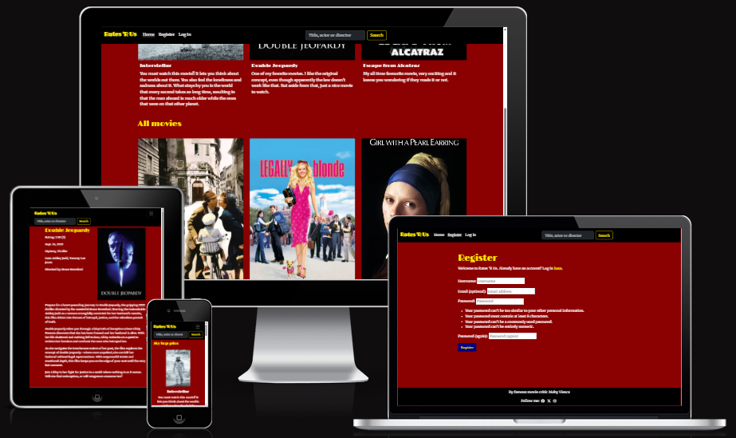
Generated by [Am I Responsive](https://ui.dev/amiresponsive).

## Index
- [Planning](#planning)
- [Features](#features)
- [Testing](#testing)
- [Technologies used](#technologies-used)
- [Deployment and development](#deployment-and-development)
- [Credits](#credits)

## Planning

### Site goals

The website aims to offer users:
- insight in movies and Moby Viesca's take on them,
- a way to rate and review movies and contribute to the overall rating.

### User stories

See [project board](https://github.com/users/LizzyonGit/projects/5/views/1) for the agile methodology followed during this project and end result.

#### As a site admin, I can:

- create, read, update and delete movie posts so that I can manage my website,
- create a draft so that I can control when and if posts will be published on the website,
- pick out several movies to be highlighted on the website so that I can make my website more personal,
- write a motivation for my chosen top movies in admin so that I can make the website more personal,
- prevent reviews from displaying so that I have control over which reviews appear on my website.

#### As a site user, I can

- view a paginated list of movie posts so that I can quickly find the movie I want to view,
- search movies on title, director or cast member so that I can find what I'm looking for,
- open a movie post so that I can read the whole post,
- register an account so that I can rate movies and add reviews,
- review a movie so that I can share my opinion,
- rate movies so that I can contribute to the overall rating of the movie,
- edit or delete my review so that I have control on my contribution to the website,
- edit or delete my rating so that I have control on my contribution to the website.

### Design
#### Database

Below is my initial database schema. I used [Lucidchart](https://lucid.app/lucidchart/) to create it.

    
Database schema
This schema includes some features I did not implement, and it misses some features that I did implement. I did not implement the **Likes** model and related field in the **Review** model. The **Top pick** functionality called for an check box and field in the **Movie** model. The *average rating* is not in the database, but implemented as a model method.

  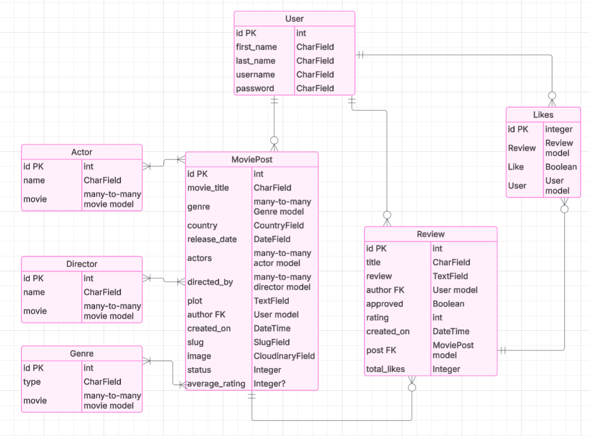

#### Wireframes

Below are my initial wireframes for mobile and laptop screen sizes. I used [Figma](https://www.figma.com/) to create them.

    
Home, movie_detail, Register, Log in and My reviews
These are my first wireframes. The final design does not differ much from the wireframes, but I did not implement a star rating, filter (but I created a search field instead), and in My reviews I did not add a filter or editing or deleting possibilities. Log out, 404 are missing.

  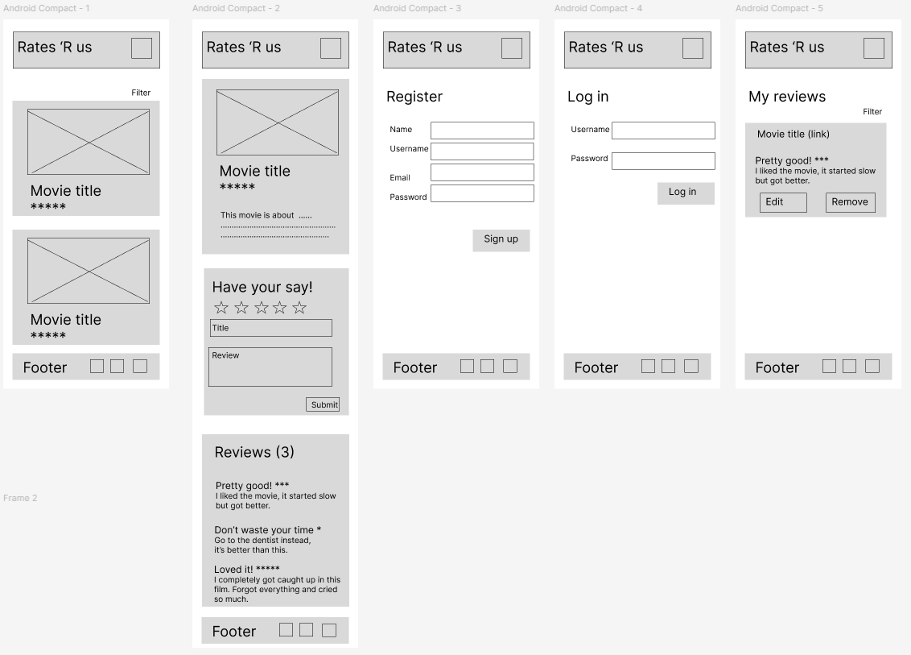

    
Home page and movie_detail
I only saw the home page and movie_detail page with all the movie poster to be different on larger screen sizes, so I only created wireframes for these pages for tablet/desktop sizes. I chenged from rows with two movies to rows with three movies, as movie posters are not wide so this fits better. Then I just moved the poster to the right in the movie_detail page and the description takes a wider space under the image and short movie facts.

  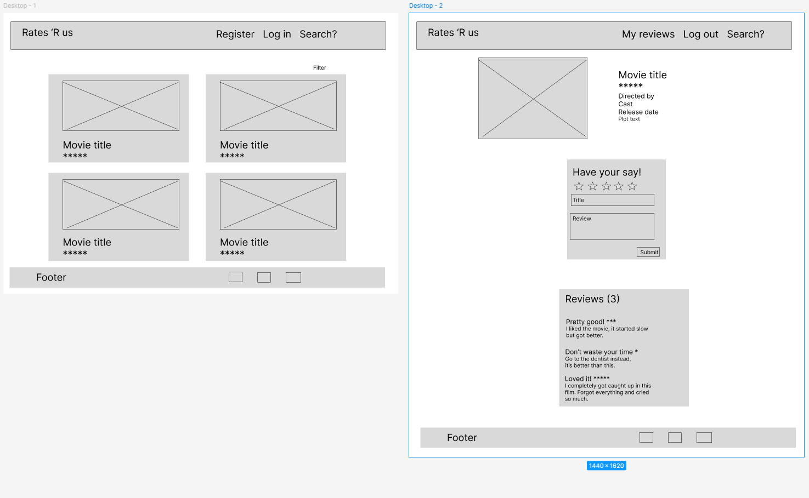

#### Colour schemes

For my colour scheme, I want to convey a home theater feeling so I took my inspiration from articles about which colours would be good when you build a theater room. Red chairs came to mind, and otherwise dark colours for walls. And some yellow details to mimic the small spotlights on the wall. I read articles https://www.happypaintingcompany.com/blog/the-top-5-best-home-theater-paint-colors/ and https://www.peliplat.com/en/article/10002576/why-are-movie-theater-seats-mostly-red and landed on the following palette:
black, navy, red, yellow.

This is my palette: https://coolors.co/ffea00-000080-8b0000-000000.

#### Fonts

I looked for a cinema feeling in my fonts and after some googleing I decided on *Limelight* for my larger font sizes and logo, and *Merriweather* for the smaller ones. *Limelight* is connected to theatre and filmmaking as per its description in [Google Fonts](https://fonts.google.com/specimen/Limelight/about), and *Merriweather* was suggested in this blog post: https://wpmudev.com/blog/more-google-font-combinations-for-you-to-use/.

#### Logos and images

The logo is the website name written in font *Limelight*.

The favicon is an image of the **R** in the logo. To create the favicon files, I used [RealFaviconGenerator](https://realfavicongenerator.net/).

All movie posters come from [TMDB](https://www.themoviedb.org/), collected via API, converted to a smaller size (via Microsoft Photos) and webP format (via [tinify](https://tinypng.com)), and manually uploaded in admin to Cloudinary. 

I made the placeholder movie poster in Microsoft Paint.

#### Content

Movie descriptions from https://aifreebox.com/list/ai-movie-description-generator.
Other movie facts from Wikipedia or IMDB.
Moby's reviews and user reviews by myself.

## Features 

### Existing features

- __Navbar__

  - The navbar holds the logo, menu links depending on login state of the user, search field and button. 

  
  

  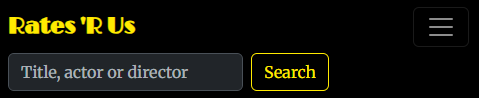

  Project file: templates/base.html

- __Home page__

   - __My top pics__

     - Max 3 top picks from admin, with poster, movie title and motivation text by Moby Viesca. The whole card serves as a link to the movie_detail page.

     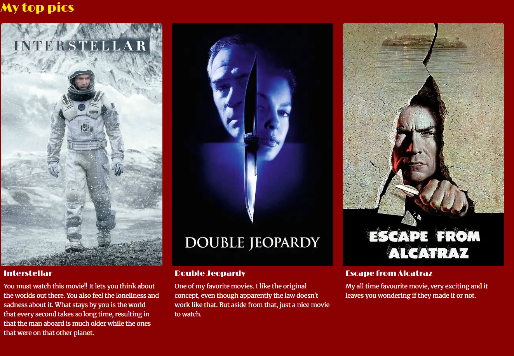

   - __All movies__

     - All published movies are listed under **All movies**. Each movie card has a movie poster, the title, rating with review count (if there is), release date, country and genres. The whole card serves as a link to the movie_detail page. 
  
     - The **All movies** are paginated and display max 3 per page. Under the movies is the button **PREV** if there is a previous page, and **NEXT** if there is a next page.
   
     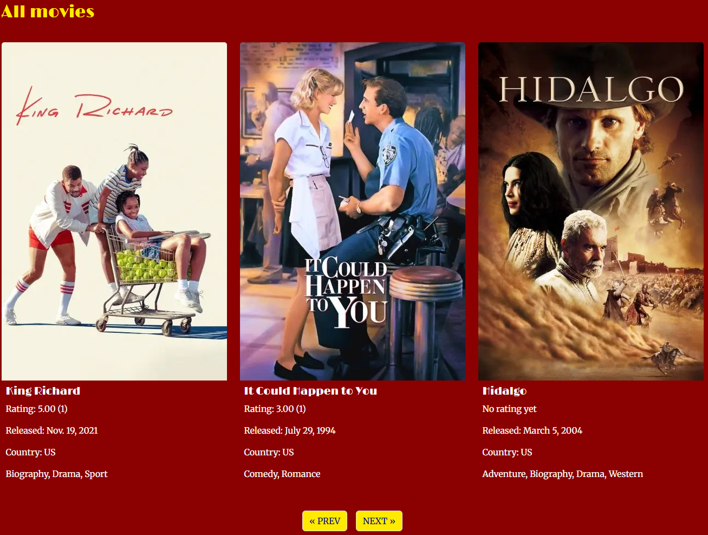

     

     Project file: movie/templates/movie/index.html
     Project file movie list: movie/templates/movie/my_list.html

- __Footer__

  - The footer has the text *By famous movie critic Moby Viesca*, and links to Facebook, X and Instagram.

  
 
  Project file: templates/base.html

- __Movie_detail__

   - Each movie has its own page with more information. It has the movie poster, title, rating and review count, release date, country, genres, cast and director(s).
   - Under it there is a movie description. 
   - If there is a motivation text in admin, there is a **Moby's review** section with this text.

   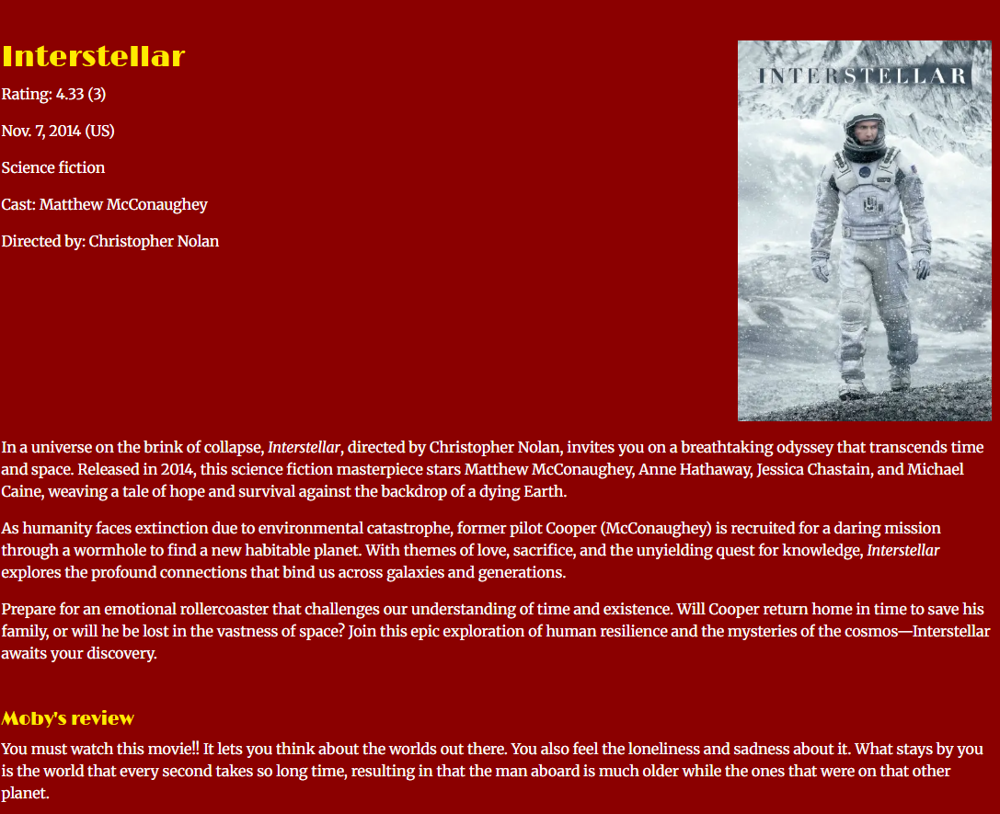
   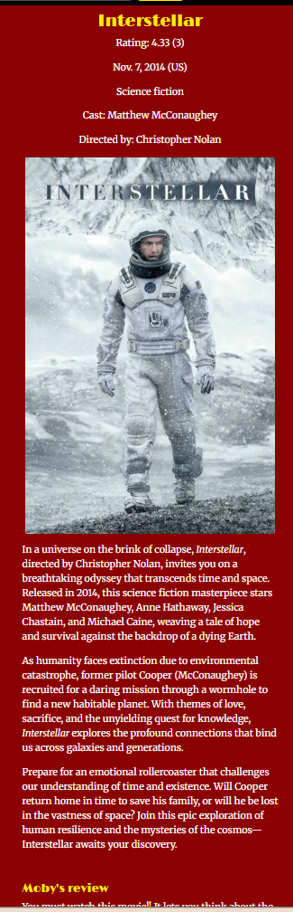

    - __Have your say!__
   
      - Starts with an icon with review count.
      - For logged out users there is only a text urging the user to register or log in to be able to add a review.
      
      

      - For logged in users, there is a form where you can give the movie a rating from 0 to 5 and write a title and text review. Only the rating is mandatory to submit the form.
 
      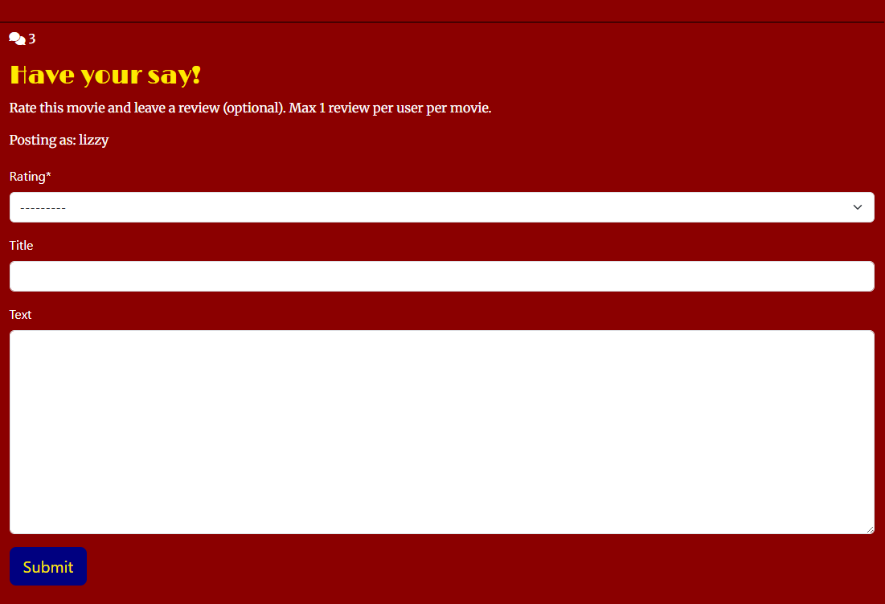
    
    - __Reviews__

      - Lists all approved reviews with newest first, with username, creation date and time of the review, title and text (if applicable) and the rating. 
      - If a logged in user has left a review, there are the buttons **Delete** and **Edit**.
      - If a logged in user has left a review that is not approved, the whole review is in italic style and there is a yellow text *This review is awaiting approval* above the buttons.

      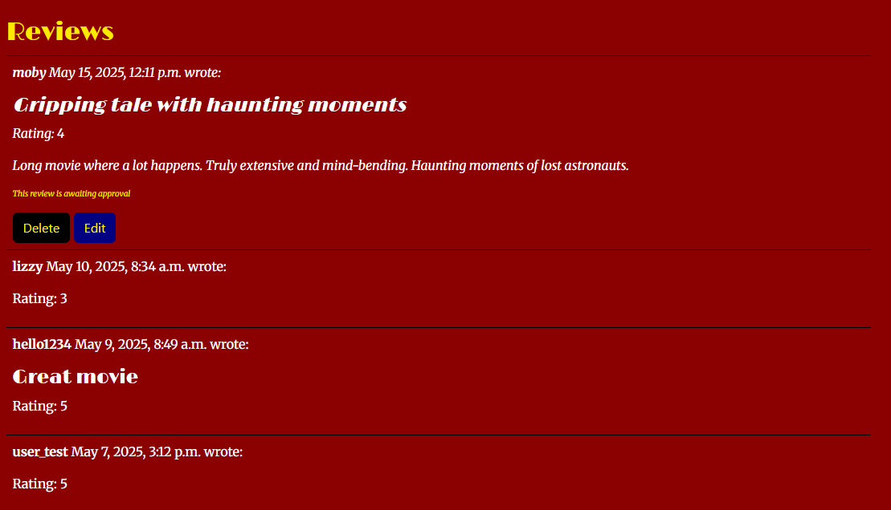

      - After clicking **Edit**, you move to the review form where the fields are populated with your review, the **Submit** button changes to **Update**.

      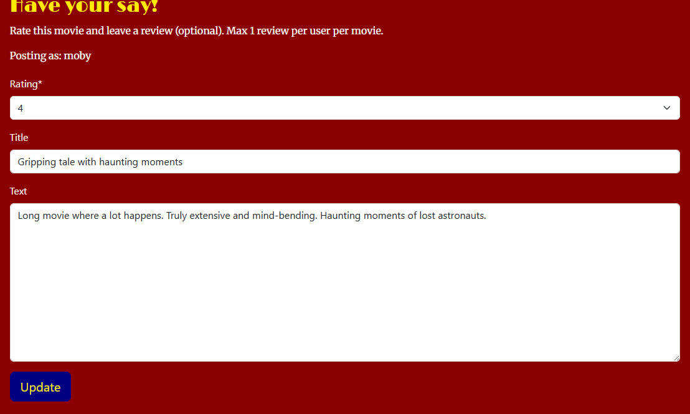

      - After clicking **Delete**, the Bootstrap **Delete review?** modal pops up where you can confirm deleting the review or close the modal and not delete the review.

      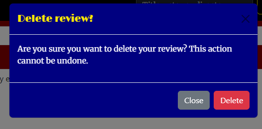
    
    Project file: movie/templates/movie/movie_detail.html

- __Search results__

   - The **Search results** page lists the movies the same way as in the **All movies** section, this is reused code. You can click the movie card to go to its movie_detail page. 
   
   - When there are no results, there is a text. I added this to urge the user to only search for one word or on one actor or director, because of the known bug that word sequences should be written exactly as how they appear to find a movie title, and that two actor or director names do not result in any found movies.
   
   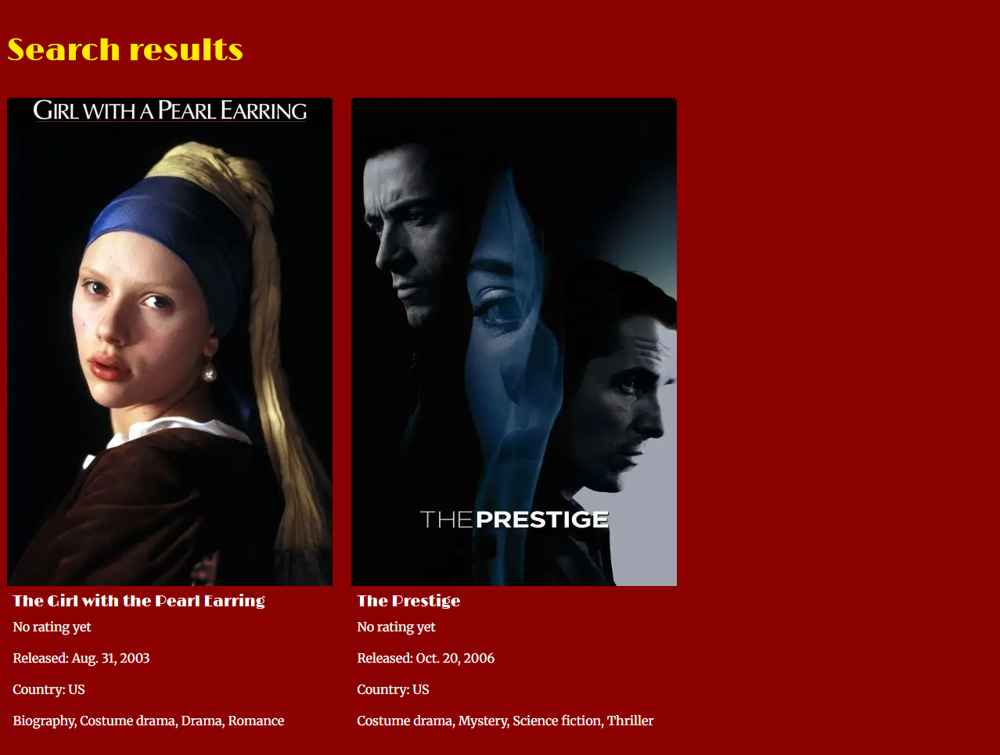
   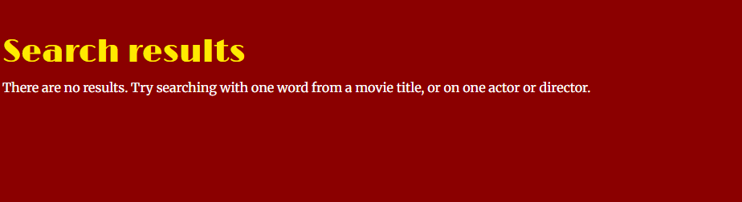

   Project file: movie/templates/movie/search_results.html
   Project file movie list: movie/templates/movie/my_list.html

- __My reviews__

   - The **My reviews** page is available when a user is logged in. When a user has left reviews, they are listed with the newest first on this page. There is no difference between approved and not-approved reviews. The reviewed movie title links to the movie's detailed page, directly to the associated review down on that page. 
   
   - If the user has not left any reviews yet, there is just a text. 
   
   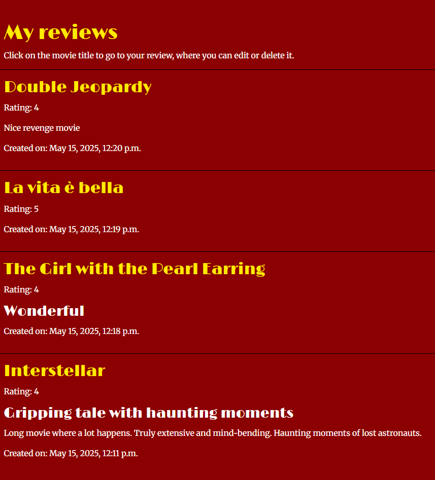
   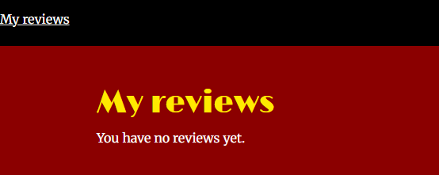

    Project file: movie/templates/movie/my_reviews.html

- __Register__

   - The **Register** page is available when a user is not logged in. There is a form and button to register and you log in right away after doing so.
   
   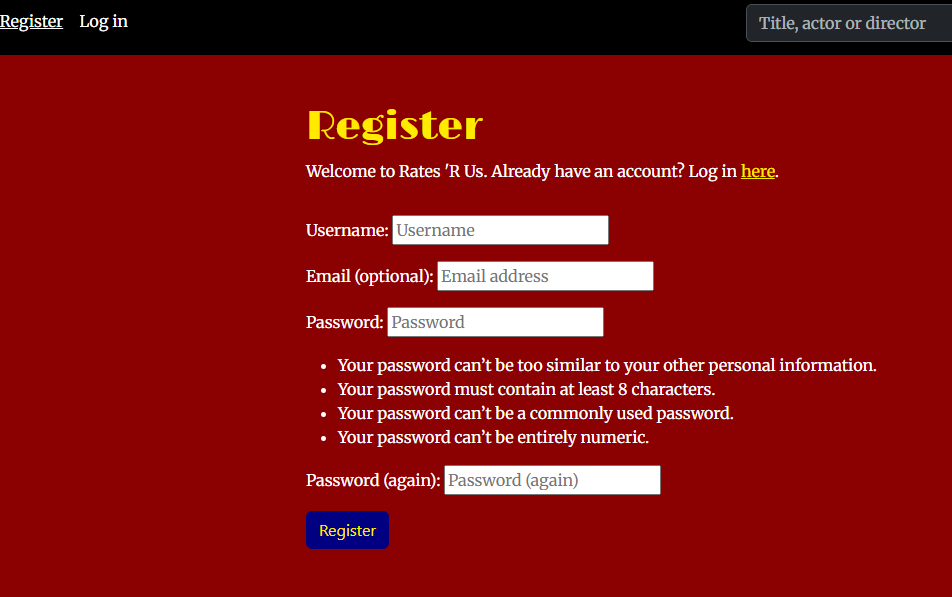

    Project file: templates/accounts/signup.html

- __Log in__

   - The **Log in** page is available when a user is not logged in. There is a form and button to log in.
   
   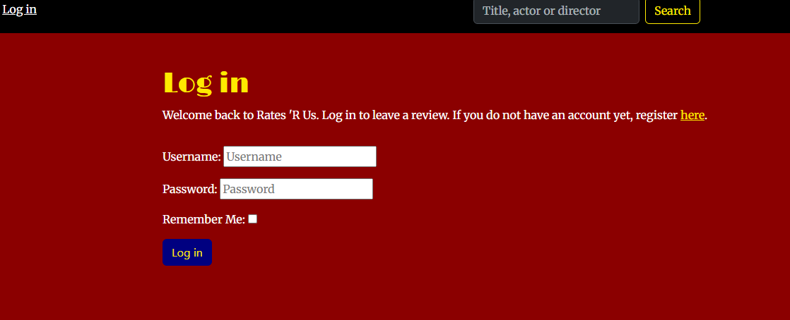

    Project file: templates/accounts/login.html

- __Log out__

   - The **Log out** page is available when a user is logged in. There is a text and button to log out.
   
   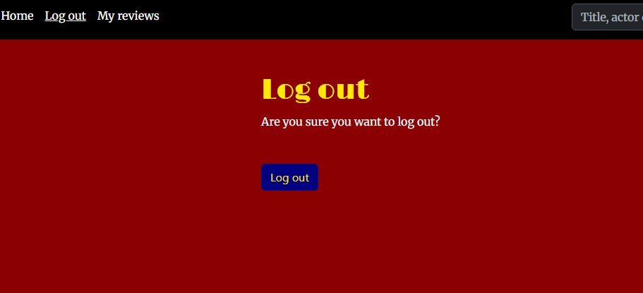

   Project file: templates/accounts/logout.html

- __Feedback messages__

   - Messages appear after you register or log in, log out and when you delete, edit and add a rating or review, or when you try to submit a second review. You can close them by clicking the cross.
   
   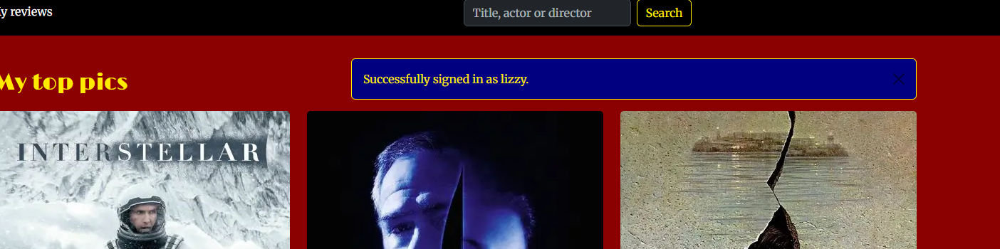
   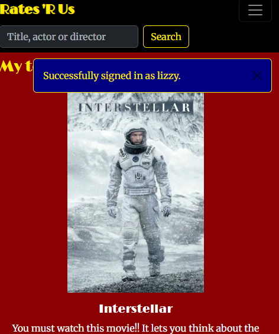

- __The 404 page__

  - The 404.html page consists of a text and button to link to the (first) home page.
  
  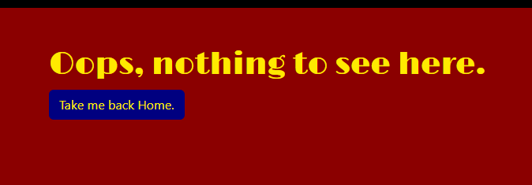

  Project file: movie/templates/404.html

### Features left to implement

- Change the **Rating** field in the review form to five empty stars where you can select a number of stars, and convert it to a rating from 0 to 5.
- For the **My reviews** page, add the edit/delete functionality and distinguish between approved/not-approved reviews, add pagination.
- Add filter in **All movies** to select on genre etc.
- The possibility for users to like a review.
- **About** page about Moby Viesca.
- The possibility for users to suggest movies to Mobie Viesca.
- Add instructions in admin.

## Testing 

See [TESTING.md](TESTING.md).

## Technologies used

### Languages

- HTML
- CSS
- Python
- JavaScript

### Frameworks - libraries - programs used

- [Django](https://www.djangoproject.com/) version 4.2.20
  - Including *django-allauth*, *django-countries*, *django-crispy-forms*, and *django-summernote*.
  - With installed withenoise and gunicorn.
- [Bootstrap](https://getbootstrap.com/) version 5.3
- [Lucidchart](https://lucid.app/lucidchart/) for database planning
- [Figma](https://www.figma.com/) for wireframes
- [VS Code](https://code.visualstudio.com/) as IDE
- [GitHub](https://github.com/) for version control
- [Heroku](https://www.heroku.com/) for hosting
- [Cloudinary](https://cloudinary.com/) for image hosting
- [Google Fonts](https://fonts.google.com/) for my font pair
- Windows Paint for creating placeholder movie poster and favicon
- Windows Photos for adjusting images
- Windows snipping tool for the favicon
- [TinyPNG](https://tinypng.com/) for compressing image size and converting to .webp
- [RealFaviconGenerator](https://realfavicongenerator.net/) for creating favicon icons and the HTML code, and checking the favicon
- DevTools for verifying responsibility and troubleshooting code
- [Responsinator](http://www.responsinator.com/) for checking responsiveness
- [Am I Responsive](https://ui.dev/amiresponsive) for an image displaying the website on different screens
- [Autoprefixer](https://autoprefixer.github.io/) for adding the necessary prefixes to my CSS stylesheet

## Deployment and development

### Deployment
The site was deployed to Heroku. The steps to deploy are:

1. Go to your Heroku dashboard and create a new app.
2. In the **Deploy** tab of your new app, under **Deployment method**, click **GitHub**. 
3. Under **Connect to GitHub**, in the field next to your username on Github, type the repository name (*LizzyonGit/rates_r_us*) of the project and click **Search**. 
4. The corresponding repository name appears below, click the **Connect** button.
5. In **Settings**, under **Config Vars**, add a value for keys *SECRET_KEY*, *DATABASE_URL* and *CLOUDINARY_URL*.
6. Scroll down to **Manual deploy**, select the main branch to deploy and click **Deploy Branch**.
7. In the top of the page, click **Open app** to open the site.

### Local development
To fork the repository:
  - In the GitHub repository, click the **Fork** button in the top right corner.

To clone the repository:
  1. In the GitHub repository, click the **Code** button.
  2. In the **Local** tab, select if you want to clone with HTTPS, SSH, or GitHub CLI, and copy the link below it.
  3. Open the terminal in your code editor and change the current working directory to the location you want to clone this repository to.
  4. Type *git clone* and paste the link from step 2, and press Enter.

Set up your IDE
  1. Set up a virtual environment.
  2. Install the packages from the requirements.txt file.
  3. Create variables for *SECRET_KEY*, *DATABASE_URL* and *CLOUDINARY_URL*.
  4. Apply migrations.
  5. Collect static files.
  6. Run the development server.

## Credits 

### Content 

- Movie descriptions from https://aifreebox.com/list/ai-movie-description-generator. Other movie facts from Wikipedia or IMDB.

### Media

- Movie posters from https://www.themoviedb.org/.

### Resources

__Planning__
- For a font pairing idea, [this article](https://wpmudev.com/blog/more-google-font-combinations-for-you-to-use/).
- To decide on which colours to use, I have researched several websites:
  - https://www.happypaintingcompany.com/blog/the-top-5-best-home-theater-paint-colors/
  - https://www.peliplat.com/en/article/10002576/why-are-movie-theater-seats-mostly-red
- For getting a colour scheme, [Coolors.co](https://coolors.co).

__During development and testing__
- Inspiration and code bits from CI walkthrough project *I think therefore I blog*.
- [Bootstrap documentation](https://getbootstrap.com/docs/5.3/getting-started/introduction/).
- [Django documentation](https://docs.djangoproject.com/)
- Forums for specific questions:
  - [Django forum](https://forum.djangoproject.com/)
  - [Stackoverflow](https://stackoverflow.com/)
  - [Reddit](https://www.reddit.com/).
- Informative sources for reading up on concepts:
  - [W3schools](https://www.w3schools.com/)
  - [MDN Web Docs](https://developer.mozilla.org/en-US/).
- [Piko Can Fly](https://www.youtube.com/@PikoCanFly) tutorials for using the TMDB API.
- *Requests* library for collecting images via API.

__Project finalisation__ 
- [Grammarly](https://www.grammarly.com/grammar-check) spellchecker.
- [Diffchecker](https://www.diffchecker.com/text-compare/) for checking Autoprefixer changes.
- Other students' readme files for how they report deployment processes.

### Acknowledgments
- My mentor Jubril for the feedback.
