# Rates 'R Us - Testing

[Live link to website](https://rates-r-us-f1ee65907d50.herokuapp.com/)

- - -

## Contents

* [Automated testing](#automated-testing)
  * [HTML validator](#html-validator)
  * [CSS validator](#css-validator)
  * [Python validator](#python-validator)
  * [JavaScript validator](#javascript-validator)
  * [Lighthouse testing](#lighthouse-testing)
  * [Favicon testing](#favicon-testing)
* [Manual testing](#manual-testing)
  * [User story testing](#user-story-testing)
  * [Issues](#issues)
    * [Logic](#logic)
    * [Accessibility](#accessibility)
    * [Error in console](#error-in-console)
    * [Responsiveness](#responsiveness)
    * [Different fruit looks](#different-fruit-looks)
    * [Safari lacks font support](#safari-lacks-font-support)
  * [Full testing](#full-testing)
    * [Browser testing](#browser-testing)
    * [Device testing](#device-testing)
    * [Feature testing](#feature-testing)
    * [Scenario testing](#scenario-testing)
    * [Unfixed bugs](#unfixed-bugs)

## Automated testing

### HTML validator

When I ran this [HTML validator](https://validator.w3.org/), I needed to add some hidden heading and I had some empty p tags because in the displayed reviews in move_detail.html, because users can chose to not write a text, but this was still displayed. So I added a condition in the template to not display anything if there is no review text. 

For the my_reviews html, it did not work to check the URL in the validator, but the source code gave no errors.

The signup page does give errors in the validator, but they are of the actual form that is used there "form.as_p". I cannot access the form to fix the code. 

Below are the direct links to the validator's result per page (for those that accepted URL input): 
 -  [Home page](https://validator.w3.org/nu/?showsource=yes&doc=https%3A%2F%2Frates-r-us-f1ee65907d50.herokuapp.com%2F)
 -  [movie_detail.html(Interstellar example)](https://validator.w3.org/nu/?showsource=yes&doc=https%3A%2F%2Frates-r-us-f1ee65907d50.herokuapp.com%2Finterstellar-2014-11-07%2F)
 -  [Log in page](https://validator.w3.org/nu/?showsource=yes&doc=https%3A%2F%2Frates-r-us-f1ee65907d50.herokuapp.com%2Faccounts%2Flogin%2F)
 -  [Log out page](https://validator.w3.org/nu/?showsource=yes&doc=https%3A%2F%2Frates-r-us-f1ee65907d50.herokuapp.com%2Faccounts%2Flogout%2F)

The search pages can be rendered with URL but the links to the validator do not work at a later time. I run the following urls and there were no errors: https://rates-r-us-f1ee65907d50.herokuapp.com/search/?q=hello (no search result), https://rates-r-us-f1ee65907d50.herokuapp.com/search/?q=bullock (1 result).

### CSS validator

For style.css, there are no errors in the [Jigsaw validator](https://jigsaw.w3.org/css-validator/). There are some warnings related to the imported Google Fonts and used variables, that can be ignored. Because I ran my code through the [Autoprefixer](https://autoprefixer.github.io/), I also get warnings about this, which can be ignored.

I have re-checked these results along the way in the testing fase, as I have changed my css continuously. Below is the latest result.

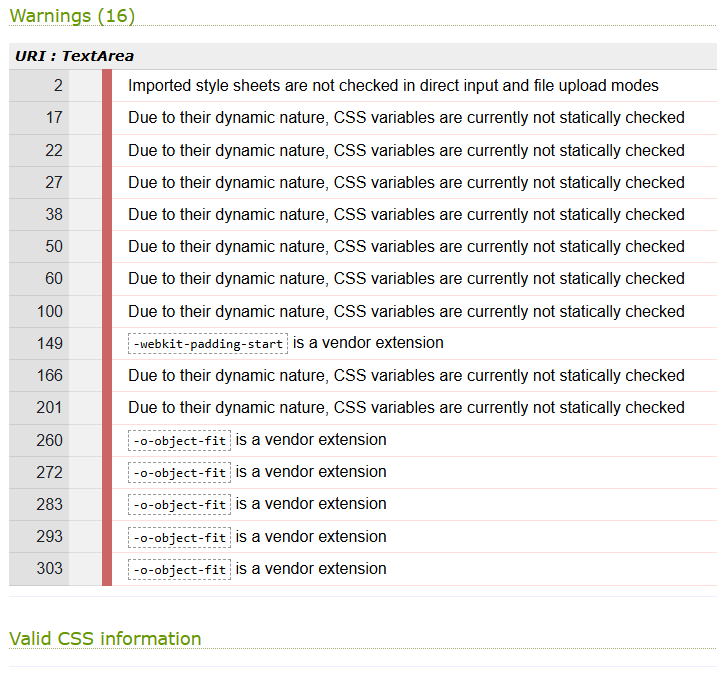

### Python validator

Firstly, I need to shorten my lines and fix the incorrect white spaces, as I have ignored these problems completely. So before running my code through the [CI Python Linter](https://pep8ci.herokuapp.com/), I will fix this in VS code with help of the PROBLEMS tab. I leave only the url links in my comments too long, as I found this is ok. The Python linter only reports these long url links. The reason I don't want to shorten them, is because the links are descriptive so it's more read-friendly in my opinion to keep the original urls (I checked [stackoverflow](https://stackoverflow.com/questions/10739843/how-should-i-format-a-long-url-in-a-python-comment-and-still-be-pep8-compliant) for this).

IMAGE NEEDED

### Javascript validator

I used [JSHint](https://jshint.com/) to validate my reviews.js file. With the setting ES6, the code passes, apart from one error: **One undefined variable: bootstrap**. This has to do with **const deleteModal = new bootstrap.Modal(document.getElementById("deleteModal"));**. I had this in my previous project as well, and ignored this error because it has to do with bootstrap not being recognised.

 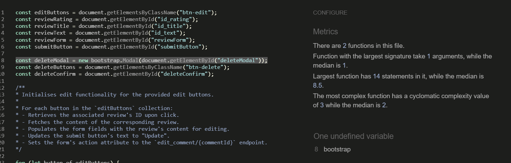

### Lighthouse testing

#### Home page

I get a best practice error saying I have insecure requests not using HTTPS. This has to do with Cloudinary, and I found a solution for this on Slack [in this thread](https://code-institute-room.slack.com/archives/C026PTF46F5/p1706622757171679). Another performance issue is the format of my images, which I though would not be relevant because it is via Cloudinary, but I still have to convert them to WebP. So I converted th images via [tinypng](https://tinypng.com/) and uploaded them again via admin.

After I addressed these, I still had some issues related to Cloudinary and third-party cookies in Chrome. But I decided to leave these issues be, because I do not want to change Cloudinary. I found that Cloudinary was supposed to come with a solution (https://community.cloudinary.com/discussion/comment/1182#Comment_1182?utm_source=community-search&utm_medium=organic-search&utm_term=chrome+cookies), but I have not found any more information. And the latest information is that Chrome might not disable third-party cookies at all (https://www.didomi.io/blog/google-chrome-third-party-cookies-april-2025). I also found that in incognito mode, this issue is gone and Best practices scores 100 %

Also, some of my images still were much larger than displayed, so I needed to fix this. I decided to cut all the movie poster images to around 416 x 624. Not all images have the same ratio, but I made sure the size is never smaller than this, as it is the largest displayed size on the largest screen size. I would urge the superuser to do this as well when they post a new movie. Now the issues I get for performance relate to my usage of Bootstrap, Heroku, Google Fonts, Cloudinary, but the score is 97 for the home page and similar scores for the next pages. For some movies with longer titles or where the image is adjusted by my css media queries I get a lower score because of larger layout shifts, but still acceptible scores of around 90 %. 

For mobile reports, my best practices is a bit lower (96 %) due to the image size being a bit different, as the images can have slightly different sizes as they are all stacked veritcally, so you do not notice different heights. The report it expects the images to be 582 x 873, instead of the 416 x 624 I have uploaded to Cloudinary. I decided to keep this as it is. 

For the mobile version, I get a low performance score due to the large movie posters. I decided to add css for screens up to 575 px and make the image smaller and center the content of the card for style purposes. I still get issues, and now it tells me to use smaller original images as well (see detail page below). But I managed to get 91 % for the first and second page.

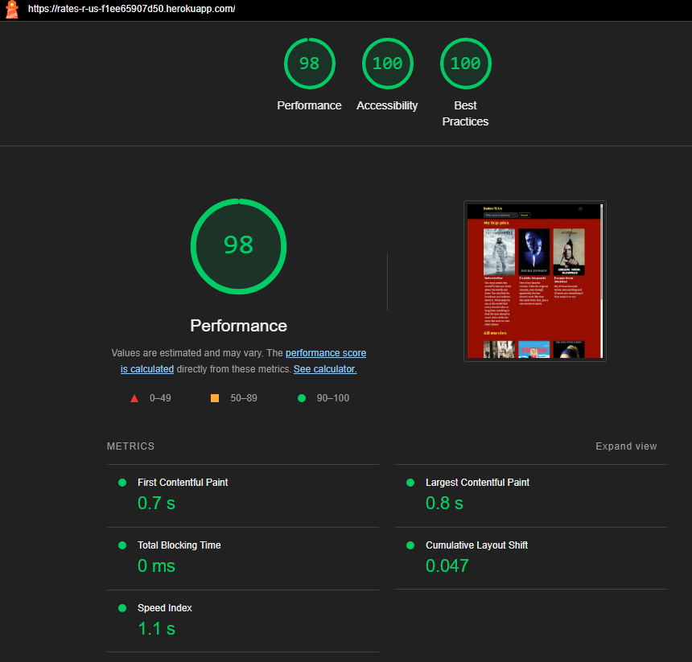
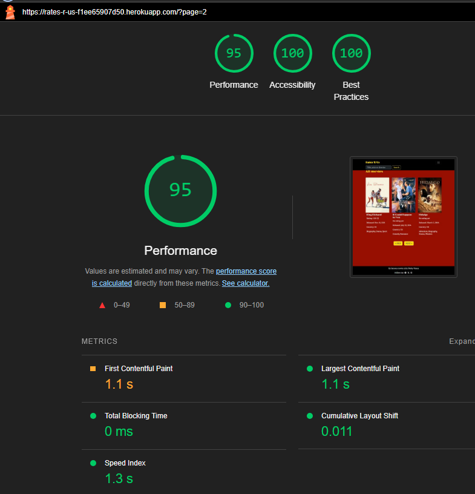

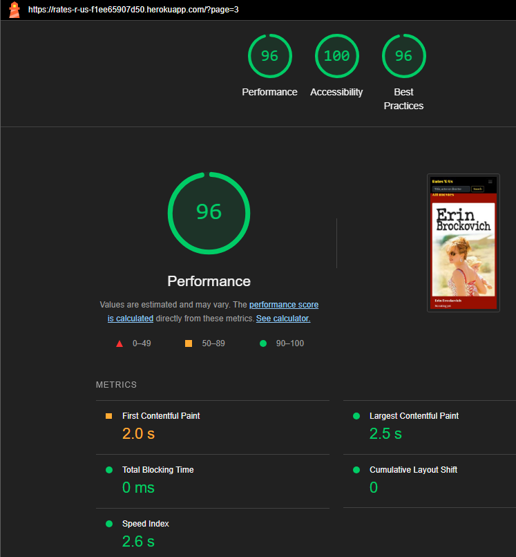
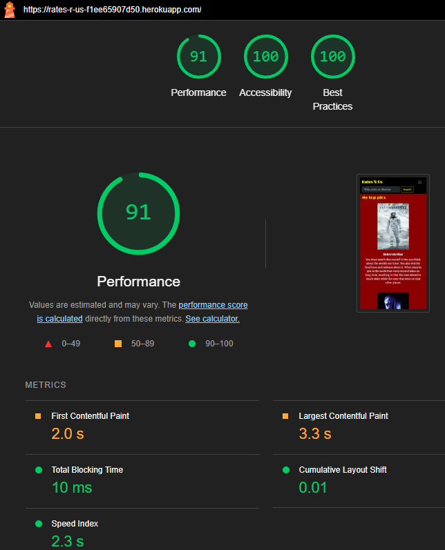

#### Detail pages

For the detail page, I get from 90 % to 99 % performance, as it only has one image. The image size on the page is smaller than the size in cloudinary because it is smaller than the largest size on the home page, so I do get an issue for that, but I will not use separate images for the home and detail page. Otherwise, I get the same kind of issues as for the home page. The scores differ a little depending on the movie, because of the different content. Movies with longer titles score lower as they have larger layout shifts. Running lighthouse at different times does affect the scrore as well, I have gotten 100 % as well as 87 % at different times.

I get a warning on best practices saying I use a deprecated API "H1UserAgentFontSizeInSection". I googled this error and found [documentation](https://developer.mozilla.org/en-US/docs/Web/HTML/Reference/Elements/Heading_Elements#specifying_a_uniform_font_size_for_h1) implying it has to do with h1 inside an article element and that the size should be specified. I tried this by adding class="h2" to my h1. But like someone mentions [here](https://github.com/GoogleChrome/lighthouse/issues/16404), this did not fix it, so then I added a piece of code 
":where(h1) {
  margin-block: 0.67em;
  font-size: 2em;
}" because someone says this should fix it, but this still did not work. I removed the code again. I decide to leave it now. I tested to remove <article> and this actually gave me 100 %. But <article> is there for semantic information, so I want to use it. So instead I used a hidden h1 above article and changed my original h1 to h2 inside the article element. This finally worked and I have 100% on best practices. For mobile I get a bit lower because of the image issue, being too small in cloudinary. But still very good scores.

For accessibility, I got a lower score because my Log in and register links only rely on colour, so I added underline to this. Now I get 100% on desktop. As I mentioned, the scores differ for each movie, but they also differ for the same movie if you run lighthouse several times, so I think the largest issues have been addressed.

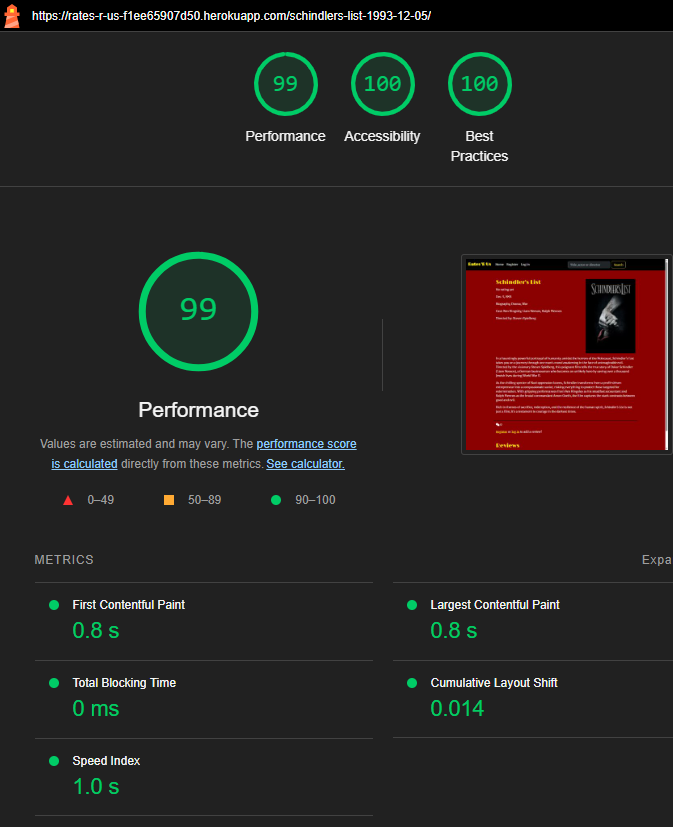

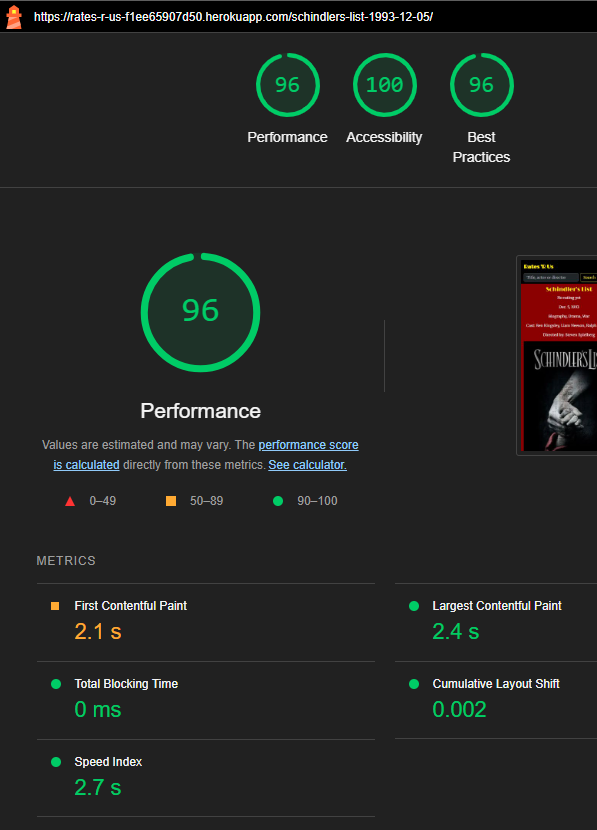

#### Search page
For the search page, I get an issue for accessibility about my headings not being in a correct descending order. This is because I reuse code from the home page, where there are h2 headings, but on the search page there is not. I added a visually hidden h2 to fix that, now it is 100 %. For search results without any result, this was not an issue in the first place.

The performance score varies but is acceptible, and I do not see how to improve this at the moment.

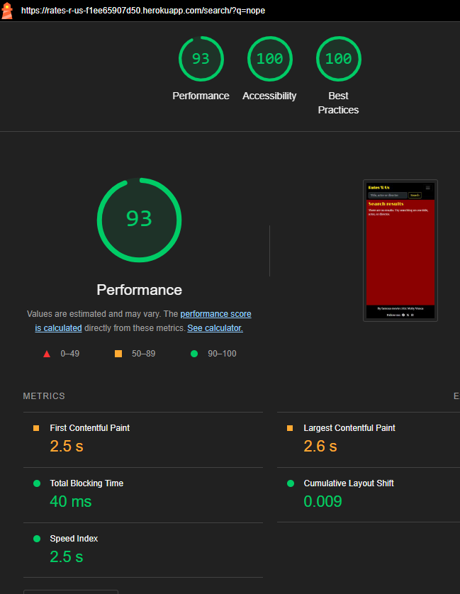

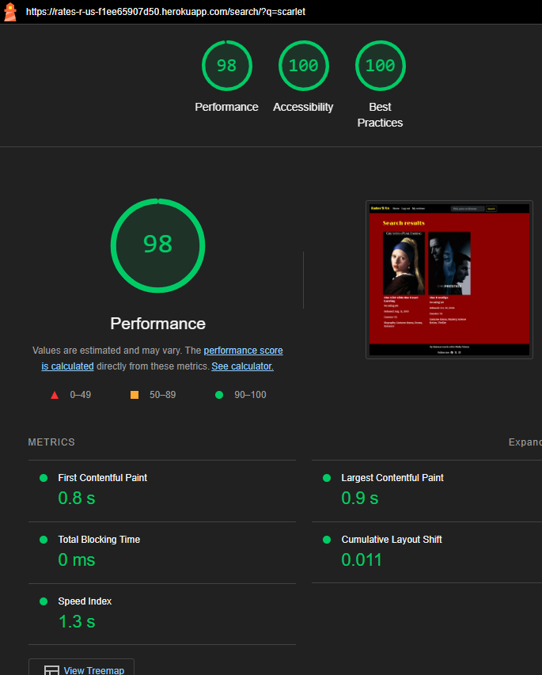

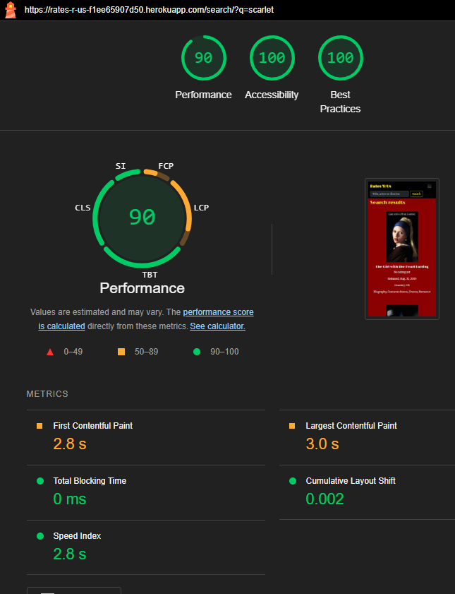

#### My reviews page

My reviews gave an issue for accessibility about my links not having discernible text. Looking better at the page with devtools, I saw the links were placed weirdly and there were a lot of empty links. The HTML validator had not seen this. I fixed the link tag to be inside the innerloop of , and added an aria-label as well. Now, the links look like they should. Rerunning Lighthouse, I get 100% for accessibility.

I get 92 (mobile) and 93 (desktop) for performance and I think this could be improved my implementing pagination. But that is out of scope for the MVP.

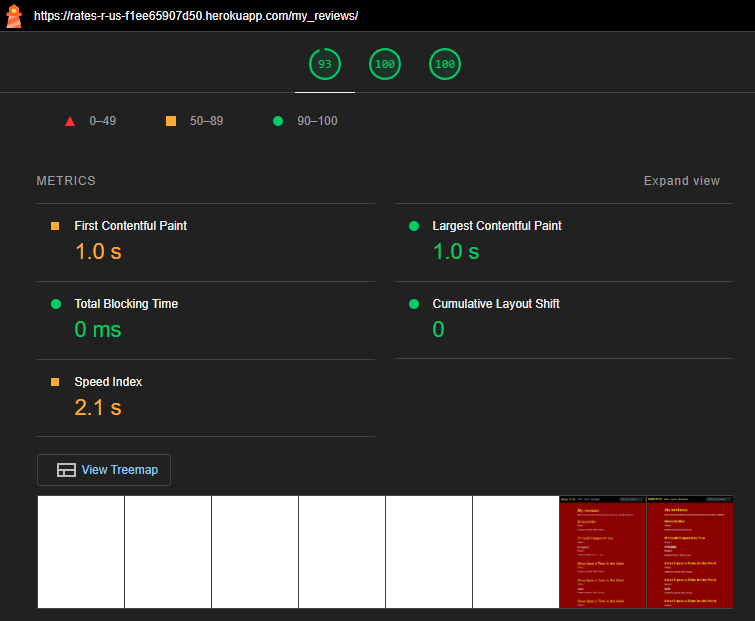

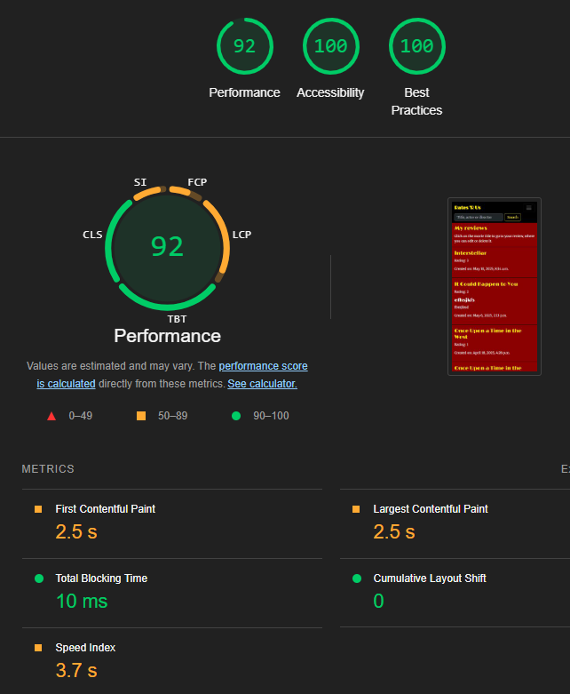

#### Log in, log out, register, 404

For the register page, I get an accessibility issue because of the default form text color. The instructions for the password are black on a red background, instead of white like the rest of my text. I fixed it in css, and also made sure the font is the primary font used for p elements. I checked the Log in page and saw that warning texts are black as well, i.e. when you enter the wrong password, so I added that in the same css style. That form does not have an id, so I had to simply set all ul and li descendants of form elements the white color and primary font family, but in this case this is ok, as I don't have ul or li in my other form to leave a review. Below are only the mobile screenshots for testing, but the desktop tests were similar.

My 404 page has a best practice issue about a 404 error in the console, otherwise ok.

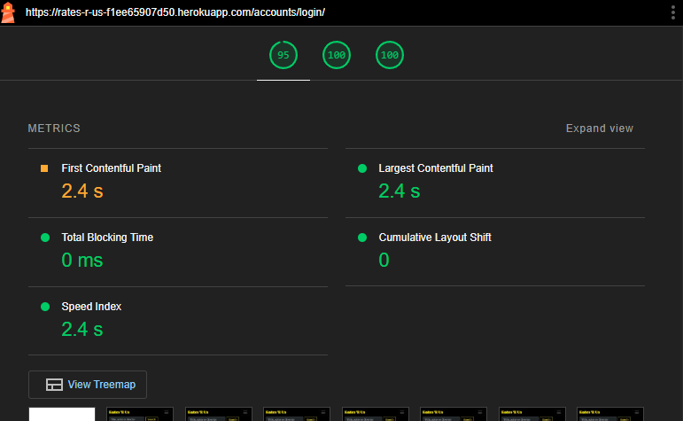

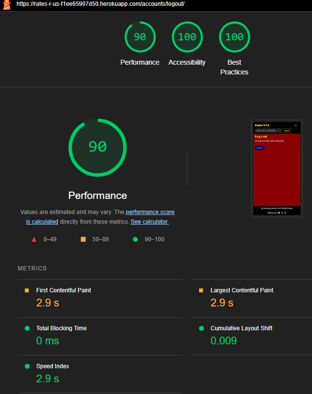

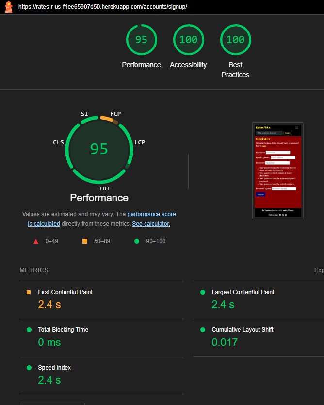

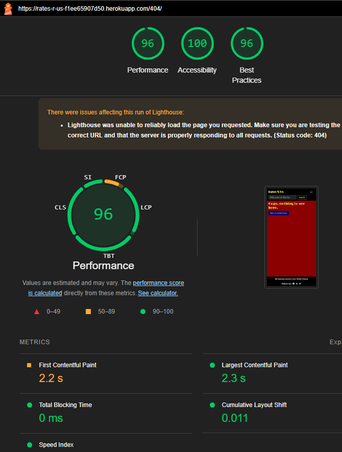

### Favicon testing
I ran https://rates-r-us-f1ee65907d50.herokuapp.com/ through Realfavicongenerator's [favicon checker](https://realfavicongenerator.net/favicon-checker/rates-r-us-f1ee65907d50.herokuapp.com%2F), and I got a warning saying my svg icon is not squared, so I created a new one. Now I just have an issue saying "No touch web app title declared", but the web site's title should be used in this case.

## Manual testing

### User story testing

|   User story                                                            | How it is achieved    |
|  -----------                                                             | -----------           |
|**As a site admin, I can:**|
|create, read, update and delete movie posts so that I can manage my website,|Admin platform with **Movies** section enables adding movies with relevant fields, updating them, and deleting them or setting them on draft so they are not visible on the website.|
|create a draft so that I can control when and if posts will be published on the website,|**Status** field in admin can be set on **Draft** and the movie will not be visible on the website.|
|pick out several movies to be highlighted on the website so that I can make my website more personal,|**Top pick** check box in admin and code functionlaity that 3 top picks will display on the first homepage on top, in admin the top picks can be filtered so the user can see which movies are selected for it.|
|write a motivation for my chosen top movies in admin so that I can make the website more personal,|**Pick motivation** field, the text will be displayed in the **Top pic** section on the home page, as well as in the movie detail page under **Moby's review** under the movie description. Even if a movie is not selected as a top pick, the motivation text will display on the movie detail page, as long as the site admin does not remove it.|
|prevent reviews from displaying so that I have control over which reviews appear on my website.|**Reviews** section in admin and the **Approved** check box in each review. A review is not publicly visible until the **Approved** check box is selected. Reviews that only consist of a rating will automaticly get approved, but the site admin can also choose to clear the check box. The reviews have a filter in admin so the site admin can filter on approved or not approved reviews.|
| | |
|**As a site user, I can:**|
|view a paginated list of movie posts so that I can quickly find the movie I want to view,|Paginated home page with max 3 movies, excluding the first home page that has a top pick section by the superuser with 3 extra movies.|
|search movies on title, director or cast member so that I can find what I'm looking for,|**Search** bar on top of the page that leads to a search result page.|
|open a movie post so that I can read the whole post,|From the home or search result page, any user can click on a movie card which leads to the respective movie detail page with the description, Moby's review and all users' (approved) reviews and ratings.|
|register an account so that I can rate movies and add reviews,|**Register** page where the user can create an account, **Log in** page to log in to account and access the movies' review form.|
|review a movie so that I can share my opinion,|When logged in, the review form is available on the movie detail page. A user who has not left a review yet, can fill in this form and submit it.|
|rate movies so that I can contribute to the overall rating of the movie,|When logged in, the review form is available on the movie detail page. A user who has not left a rating yet, can add a rating. If the user does not leave a text review, the rating will be published immediately and calculated in the average movie rating. If the user leaves a text review as well as a rating, the review needs to be approved before the rating will be calculated in the average movie rating.|
|edit or delete my review so that I have control on my contribution to the website|When logged in, a user can view all their reviews on the **My reviews** page. The user can click on the review to go to the specific review on the movie's detail page, and there, the user can click **Edit**. The user moves up to the review form where the old review is displayed, the user can change anything and click **Update**. If the updated review has text, it needs to be approved again by the site admin to be published. If a user clicks **Delete**, a modal pops up where the user can confirm deleting the review, and the review will be removed.|
|edit or delete my rate so that I have control on my contribution to the website,|This works the same as editing or deleting a review, but when a user only rates a movie without any text contribution, the edited rating will be approved automatically and calculated in the movie rating average.|

### Issues

Here I list some issues and bugs that took extra effort to fix.

#### Many-to-many fields

The **Genre** field in the **Movie** model is a many-to-many field and I had some trouble displaying it correctly in html. This was fixed with *.all* in the template (*{{ movie.genre.all|join:", " }}*).

In admin, when you add a movie, the **Cast** is also a many-to-many field. To get this to work as a list of actors that you can select from easily when you add cast members to a movie, and search if the actor is already in the list of created actors, I added a *horizontal filter* (https://stackoverflow.com/questions/14828168/django-show-filter-horizontal-on-user-change-admin-page, https://stackoverflow.com/questions/73570167/django-filter-horizontal-how-to-connect-more-fields-together). I did this for **Genre** and **Directed by** as well, as they are also many-to-many fields.

Another issue I had was related to the search field in admin. I want the site admin to be able to search on actor in admin, and get all movies where this actor is playing. To get this to work, I had to use **cast__name** in *search_fields = ['movie_title', 'cast__name']* in admin.py (https://docs.djangoproject.com/en/5.2/ref/contrib/admin/#django.contrib.admin.ModelAdmin.search_fields, https://stackoverflow.com/questions/51931762/how-can-we-search-many-to-many-field-in-django-admin-search-field). For the search field in the **Review** model, to find all reviews for a specific movie, it was also needed to use **movie__movie_title**.

#### Review functionality

##### Approve review when there is no text, only a rating

I wanted to approve reviews automatically when there is no text, only a rating, so it is published right away and calculated in the movie's average rating. So I thought about a conditional default value of the approved field, a simple if else statement. I had trouble finding the answer to this, but then I found https://stackoverflow.com/questions/12649659/how-to-set-a-django-model-fields-default-value-to-a-function-call-callable-e/15289517. It did not work, and I tried different places to put the code, below, above, inside the review model. But I read that the field itself cannot have an if statement, so I thought it should be a callable. But I tried something else instead, and added it in the view before the review is saved to the database. Now it sets approved to True when both the title and text are empty, and it displays an appropriate message and the rating is visible and calculated into the average right away. And when title and text are not empty, it needs to be approved by the site admin. In admin, when I add a review with empty title and text, it does not get approved right away, which I think is not a relevant issue as the superuser can just approve it.

In admin when the review title is empty, you can not click it to approve. So when a review's title is empty but there is a text, the site admin could not approve it. So I thought about changing the review title being mandatory. I also thought about customising admin, by setting the *str* method on the model so it would represented as a link in the list display in admin, and clickable. But that turned out has no effect when there is list_display. So i tried to set a title value of *Open* before it saves in the views.py, but that did not work for when you as a user add a space in the title. It turned out that when you just add a space in the review's title, it does not need to be approved, which is very good. But in case of the user adding a space in the title but text in the review text, the title is not clickable in admin, because it does not change to *Open*. I could have ofcourse added that to the condition in views.py, but I thought there should be a better way. I realised that I needed to add *null=True* (now it just had *blank=True*) to the title field (or I tested out lots of different things at this point, https://medium.com/techtrends-digest/what-is-the-difference-between-null-true-and-blank-true-in-django-3b49be024ec5), so that I can have title as the clickable link in admin, since that is good when there is a title, and this *null=True* also fixed that empty titles are dispalyed as *-* in admin, which is good enough since it is clickable so the superuser can approve it. 

Because of *null=True* in the **Review** model title, *None* got displayed as a title in the frontend when a user added a review with no title. So in the template, I had to add another if statement to only display the title if it is not empty.

Along the way, I did get an issue where after adding only a rating, the average would be updated but the number of ratings in brackets would not be updated. This would be corrected after refreshing the page. This was eventually fixed and I am not sure at what point, probably after approving ratings directly in the view.

##### Edit reviews

I found that all 3 of my review form fields had the same id, and this hindered the edit functionality because the user should be able to update all three fields, so I should be able to access the fields separately. Also, it is not good HTML to have similar ids of course. So I needed to fix this. I thought it was because of crispy, but it turned out it was simply in the template.

Editing the rating field was harder, because after clicking **Edit**, the original rating did not render in the form to update the review. I used print statements to see what values my variables actually got. I needed to access the rating value in a different way than usual, because it said *Rating {{review.rating}}* in the template, and in Devtools it said *Rating: 4* in plain text, so the question was how to access the 4? In this construction, the rating number is always the last character of the string, so I took help from https://javascript.plainenglish.io/javascript-get-last-character-of-string-4a7ac4d52bea, and fetched the number from the string that way. Then, I found *selectedIndex* on stackoverflow and set the *selectedIndex* of the rating field at the rating number plus 1, so I would get the correct value on the field, since index[1] corresponds with a rating of 0, and so forth. 

Sometimes editing did not work, the **Submit** button did not change to **Update** on reviews with only a rating. This was because of the javascript code, since I am collecting content (review title and text) that is not there. I also got an error like this in the console, that it "cannot read properties of null". So I added javascript if statements to evaluate these fields only if they are not empty in the current review. This worked. I was surprised it worked, I thought maybe then you can not add a title and text to a current review that had none, but it still worked. I guess the rest is handled by the view and works as normal as though you would submit a new review.

Another issue, when you wanted to edit a review with a title and text, and would remove the title and text so there is only a rating left, and you updated it, it needed to be approved again. This should not happen as reviews with only a rating do not need approval. I needed to adjust the *if review_form.is_valid() and review.author == request.user:* in the edit_review view corresponding to the code in the movie_detail view. So I added an if else statement to set approved to True if there is no title and text in the new review, and otherwise approved is set to False. I also adapted the message to the two different situations for clearer feedback to the user.

##### Display average rating

Getting the average movie rating on my home page for each listed movie was not straightforward. I had it displayed in the movie_detail page and view, so I looked for a way of getting that exact value for the index.html template, without adding it to my view for the index.html. I found articles about context processors, and some other concepts, but they seemed too complicated for such an easy thing. Then I read through https://forum.djangoproject.com/t/aggregate-an-average-from-two-fields-from-separate-models/19705/2, and I realised I was wrong all along, I should have added my calculation of averages in the **Movie** model as a method, so then I could use that in all my templates based on the **Movie** model. So I did that, and it worked. 

I also read that *.count* can be used directly in the template instead of adding it as a variable in the view, so I did that, and on some forum (https://www.reddit.com/r/djangolearning/comments/jtvbxn/rounding_an_aggregation_to_2_decimal_places/) someone said that rounding to two decimals is best done in the template to avoid calculation errors, so I did that with *|floatformat:2*. The good thing is that now I could also easily add it to my search results list and page.

##### One review per movie per user

I found a useful post (https://stackoverflow.com/questions/46082573/django-forms-allow-logged-in-user-to-submit-only-one-comment-per-individual-pos) about implementing this limitation and followed those steps to implement this in the view, and in the template. Then the only issue was that after you leave a review and get the confirmation message, the form is still there since the page is not updated. So I just added the same return statements as when you edit or delete a review, and this worked. Now, after giving a review, you see the confirmation message and the form is gone.

But this raised a bug, when you edit a review, the form does not show because it is set to not be visible when there is already a review by the user. I found a suggestion here: https://stackoverflow.com/questions/792410/django-how-can-i-identify-the-calling-view-from-a-template, by Carl Meyer, to create different template blocks. However, I went with the easier solution of instead of hiding the form and raising a *PermissionDenied* exception, I added an error message when you try to submit a new review in the movie_detail view, and this worked. So the user should read that they can only give 1 review per movie, as is written in the form header.

For a user who is not logged in, I got an error trying to view the movie_detail pages: *Field 'id' expected a number but got <SimpleLazyObject: <django.contrib.auth.models.AnonymousUser object at 0x00000189D24B7470>>.*. I realised my page was checking the id of a user, and this caused the error for not logged in users. The page was checking this because I wanted to hide the form for when a user has left a review already. So I just needed to move my "user_reviews = movie.reviews.filter(author=request.user)" inside the "if request.method == "POST":" condition (as not logged in users cannot post anything because they don't see the form), and remove it from the context, and the issue was fixed.

##### My reviews page

Creating a **My reviews** page was not hard, and linking to the correct movie detail page from each review was in the end doable in the template, as I was struggling to fix the slug in the view, but ended up with a simple for loop and if statement in the template. I wanted to link to the specific review on the movie detail page, and this was easy with the help of this forum: https://www.reddit.com/r/django/comments/fjbx0c/linking_to_an_anchor_on_another_page_in_django/.

#### Populate the database via TMDB API

I wanted to add movie data from the TMDB API into my website and followed a tutorial doing something like this, but it ignored admin and the fact that I want to add the possibility for the superuser to change info and add the top pick text. I looked a lot for this issue but all solutions seemed to use the views.py file, and I felt I did not need to do it there, because my views.py works fine collecting data from the models. This post seemed promising and easy, so I decided to test it: https://stackoverflow.com/questions/32139777/populate-django-database-with-data-from-api-get-request by Shobhit Srivastava. So I decided to change back some of the changes I did following the tutorial and restore urls.py and views.py to what it was. I halfway stopped trying populating the database as I saw too many issues arrising, like the directors not being accessible directly in TMDB. 

My real reason for trying to get API data is that I needed movie images that I am allowed to use and that are not affected by copyright. So I went to look for a simple way to get those images only and upload them manually in my admin through Cloudinary. This was not easy either, but with *urllib.request* (https://stackoverflow.com/questions/30229231/python-save-image-from-url, Ankit Lad), I managed. With https://www.kaggle.com/code/mrinalkalitapy20/data-extraction-using-python-and-tmdb-api I found how to make simple requests, so I decided to create a new file get_api.py and run that to get the images I need. I put this file in gitignore as it is not needed anywhere and just for internal use to get the images. This way, I did not need to keep the API key a secret since the whole file would be secret, since I was struggling with accessing the settings variable somehow.

#### Index page design

I wanted to add something so that the index page is not just a list of movies. Other movie websites have several blocks with content or images and genre based rows. So to add something extra to the home page, I decided to create a feature with top picks by the superuser to display on the home page. The superuser is supposedly a famous movie critic Moby Viesca (or his workers pretend to be him). The superuser can change the top picks whenever so other movies get the spot. This extra feature actually called for a bit more background information on the website since it becomes personalised, so I added the movie critic's name in the footer.

To only display the top picks on the first page was more difficult than I thought it would be, it did not work to use a simple *if page does not have prev* condition, which effectively is the same as the first page. Then I found that I could use the variable *page_obj.number* and used *page_obj.number == 1* as a condition to only display the top picks on the first page. 

But, the pagination also affected the top picks, so I needed to fix that pagination would only affect the all movies section.

I found a way to put the logic in the view and add two different querysets to the class based view of index.html, with help from a post from Pran Kumar Sarkar (https://stackoverflow.com/questions/48872380/display-multiple-queryset-in-list-view). I used this to create a queryset for all published movies, and one for all published movies with top_pick selected. And by adding the [:3] it was easy to just get 3 movies. 

Now I just had to fix the pagination issue. With the solution of two querysets for the ListView, *paginate_by* raised an error so I needed to check a different way to paginate. I checked similar issues on the internet and realised it has to do with me having two dictionaries in my queryset, so it does not know which queryset to paginate. Here it says I should use another method: https://stackoverflow.com/questions/60560493/django-listview-pagination-when-passing-multiple-objects-in-queryset, and I also found it in the django docs that that is better to do, so I had to change it. 

After changing it and redoing the html template tags, it worked to paginate. Now, it also worked to have the condition of if page_obj.number == 1 % in my template, so the top picks only appear on the first page. The [:3] worked for this context override as well, so I kept that to only fetch 3 top picks. 

I have also decided that it makes more sense to display some sort of top pick motivation for the movie, so I added a text field to the model allowing the superuser to write a text (max 300 characters) for the top pick motivation, and if the field is not empty, display it in the index html in the top pic section (as well as in the movie detail view).

#### Summernote editor and text colour

I realised that with the default Summernote rich text editor, the font colour was set in html and I could not override this. But I needed the text to be white, like the other normal fields in the movie_detail view. So I looked for a way to remove the possibility of choosing a font colour in the Summernote field, and found https://github.com/lqez/django-summernote/blob/main/README.md. So I added a custom toolbar for Summernote in settings.py. I also removed the font family from the toolbar so this would also be the same as the other fields. Now, the superuser can add some styles only. I had to check all the existing plot fields and make sure there were no previous styles in the html code, otherwise they would still be the wrong colour.

#### Messages

First, I had a personal welcome message that stayed on the screen, and I could not find an easy way to remove it, as it would come back with each new page load. So now, I only use django messages. They can be removed with the cross.

#### Security

I got a GitHub warning about gunicorn and needed to upgrade to a higher version than CIs walkthrough. So I installed gunicorn again and adjusted the requirements.txt. I needed to ask a question on slack how to do this.

#### Responsiveness

I used Chrome developer tools along the way to fix responsiveness with media queries and bootstrap classes. Finally, I used [Responsinator](http://www.responsinator.com/) to check responsiveness, after installing *Ignore X-Frame headers*. I could however not log in and check **My reviews**.

I noticed I needed extra padding on the home page from the second page, because the **Top pic** section is not there and when the navbar is wider on small screens, it overlaps a bit.

For the **Register** and **Log in** pages, there was need for margin below the form button. Even if I could not log in, I assumed the same would be true for the **Log out** page. I simply changed *mt-3* to *my-3*.

In the reviews, there was need for a space between the username and date.

##### Screen size adaptations

The different media queries based on screen size work as intended. Mainly the poster size on the index pages needed different media queries. At each breaking point, I added a max-height, and a set height on the largest screen size above 1400 px. For the movie_detail page, for screen sizes above 992 px, the max-height is also limited. I added an additional size limit of 50 % to screens up to 575px because the movie poster size was too large for performance.

The poster sizes work with the movie posters I have uploaded, but if a superuser would create a new movie, it is not given that any poster works with these sizes. So I would need to add instructions that uploaded movie posters should remain at 416x624 (or similar) so the poster is still displayed well.

The displayed messages have some customised padding to not cover the navbar, but it is ok if it covers content as you can click it away.

Another small adaptation is the padding for the card-body class where the movie motivation and title is written in the **Top pic** section, the padding is a bit smaller to make place for longer words.

I have also used Bootstrap classes for different col, margin and padding values at different screen sizes, as well as for text alignment and flexbox properties.

### Full testing

#### Browser testing

I tested on Chrome, Edge and FireFox. The layout and functionality were tested in Safari as well.

In FireFox and Edge devtools, everything looks good and there are no errors in the console. I noticed that with the splitting of the messages that was needed for python, I needed to add a space between two sentences.

#### Device testing

Tested extensively on a Dell laptop, and on a Lenovo laptop, and Huawei phone.

#### Feature testing

|Feature|Expected outcome|Testing performed|Result|Pass/Fail|
|Navbar|
|Navbar links when logged out|**Log in** and **Register** appear when not logged in|Made sure I am logged out and clicked the links|The links appear and go to the correct pages|Pass|
|Navbar links when logged in|**Log out** and **My reviews** appear when logged in|Made sure I am logged in and clicked the links|The links appear and go to the correct pages|Pass|
|Navbar links to Home|**Home** is always visible, both **Home** and logo go to first home page|Clicked the links|Logo and **Home** go to (first) home page|Pass|

|Search field and button|Can fill in the field, can click **Search** and go to **Search results** page|Clicked **Search** both with and without typed text in field|Can type text in field, click **Search** and it will go to **Search results** page|Pass|
|Home page(s)|
|**My top pics** section on first home page|Displays max 3 movies from admin, displays motivation text if it is there|Selected/deslected **Top pick** checkbox in admin, added/removed text motivation, selected more than 3 movies as top pick|Displays 3 movies even if more are selected as top pick, displays text motivation if it is filled in in admin, displays top picks only on first home page|Pass|
|**All movies**|All published movies appear, draft movies do not appear|Add/update movies with status **Published** and **Draft**|Only published movies are posted on the home page|Pass|
|Pagination|Max 3 movies per page, except first page that has **My top pics** section, **PREV**/**NEXT** buttons underneath the page|Moved through the pages|**PREV**/**NEXT** buttons, max 3 movies per page under **All movies**|Pass|

|Footer| --- | --- | --- | --- |
|Footer|Links to social media opening in new tabs|Clicked links in footer|Links open in new tabs|Pass|
|**Search results** page| --- | --- | --- | --- |
|**Search results** page|Alphabetically ordered movie results, text if no result|Search on search terms, without search term, and with search term which should not have a result|Not filling in any search term gives all movies alphabetically, searching for actor, director or title gives relevant movies, if no result there is a text that there are no results|Pass|
|Movie's rating, release date, country, genres under **All movies** and in **Search results** page|Average rating with nr of ratings in brackets, text when there is no rating, release date, country displayed from admin, and genres displayed with comma's inbetween if there are several|Checked for movies with no rating, added/deleted ratings to see updates, checked outcome for one or more genres in admin, different countries and release dates|Ratings is displayed with nr in brackets, *No rating yet* displayed when there is no approved rating, release data and country correct according to admin, genre correctly displayed with comma's if there is more than one|Pass|
|Movie_detail page| --- | --- | --- | --- |
|Open movie_detail page|Clicking on movie card from home page(s) or **Search results** goes to movie_detail page|Clicked movie cards both as logged in and logged out|Opens correct movie_detial page|Pass|
|Information|Rating and reviews nr, release date, genre, cast and director(s) next to movie poster, description underneath|Check all movies and update rating and other admin information|Rating and review count updated accordingly, all other informaton as well. Direcotr shows also comma when more than 1|Pass|
|**Moby's review**|Section appears when there is motivation text in admin, regardless of top pick selection|Change admin movie with motivation text and no text, **Top pick** selected and not| Section appears when there is text, dissappears when no text|Pass|
|Review count|Approved reviews display next to the icon|Add/remove reviews, approve/unapprove reviews|Review count only counts approved reviews|Pass|
|**Have your say!** form for logged in user|Form appears when logged in|Log in and check the section|Form is displayed when logged in|Pass|
|**Have your say!** form for logged out user|Instead of form there is a text urging user to log in or register|Log out and check section|Form is not there, there is text *Register or log in to add a review!* with links to log in or register|Pass|
|Review submission and message/result for different review sorts| --- | --- | --- | --- |
|Only rating|Selecting 1 to 5 and adding no text results in approved rating and message, rating is added in rating average and count. Rating appears in **Reviews** section.|Submit review form with only rating selected, tried also to not leave a rating at all|Cannot submit form without rating, submitted form with rating only results in approved review, message says *Thank you for your rating*, rating is added to average, review count and in **Reviews** section|Pass|
|Rating and/or title and/or text|A submitted review with text in *Title**, **Text** or both fields is not approved right away and does not count or appear for other users|Submit review with test in either fields or both, switch users|After submitting a review with text, message *Thank you for your review.It will be published after approval.* comes up. Review is not added to count or average, and appears in italic style in **Reviews** section with *This review is awaiting approval* under it. It does not appear to logged out or other logged in users|Pass|
|Submit second review|Should not be possible to leave more than 1 review/rating per movie per user|Try to submit second rating/review|After clicking **Submit**, a message appears *You have already reviewed this movie.*, and nothing changes on the movie_detail page (no added review or rating anywhere, form is cleared)|Pass|
|**Reviews** section| --- | --- | --- | --- |
|Reviews display for user who has written a review|After submitting a review that is still to be approved, the reviewer can see the review|Submit review with text and check for the review while logged in|The still unapproved review is there when logged in, it is not there when logged out/for other logged in users|Pass|
|Review update and message/result for different review sorts|A user can edit their own review, form should be filled with current review fields, button changes to **Update**, and after submitting should be approved according to same rules as first review and display informative message|I click on **Edit**, change something and click **Uppdate**. I try both removing all text or not to see different messages.|Changing a review while still having text needs to be approved again and message *Review updated and awaiting approval* appears, also when no text has been changed, it needs to be approved again (this is ok because it will probably not happen a lot). Removing text and updating the review with only a rating approves the review right away and message *Review updated and published* appears and average rating is updated and rating is visible for everyone.|Pass|
|Review deletion and message/result|A logged in user can delete their own review with button, modal pops up for confirmation|Click **Delete** on review, click **Delete** in modal or click **Close**, cross or outside the modal|Logged in user can click **Delete**, modal comes up. Clicking **Delete** again will gives message *Review deleted*, and review is no longer in *Reviews section** and removed from average and review count, click cross, **Close** or outside modal, nothing happens.|Pass|
|**My reviews**| --- | --- | --- | --- |
|When there are reviews, all are listed|Lists all reviews (reviewed movie, given rating, title, text, review creation date) left by the logged in user|Logged in as user without reviews and with reviews to see what is on the page|Users who have left reviews see them listed, newest first, there is no distinction between approved/not-approved reviews. Users who have not left reviews see text *You have no reviews yet.*|Pass|
|Review links to concurrent review on movie_detail page|The title of the movie links to the applicable review left by the user on that movie_detail page.|Click on title of movie|Links to movie_detail page and scrolls down to review right away|Pass|
|Account handling and feedback| --- | --- | --- | --- |
|**Register** page and message|After filling in the form and clicking **Register**, the user is registred and sees a feedback message|Register new user|After filling in the fields and clicking **Register**, the user is logged in automatically and message *Successfully signed in as (Username).* appears|Pass|
|**Log in** page and message|After filling in the form and clicking **Log in**, the user is logged in and sees a feedback message|Log in with username and password, click **Log in**|After filling in the correct username and password, clicking **Log in**, message *Successfully signed in as (Username).* appears and the user is logged in|Pass|
|**Log out** page and message|After clicking **Log out**, there should be a message and the user should be logged out|Log in and go to **Log out** page, click **Log out**|After clicking **Log out**, message *You have signed out.* comes up and user's state is logged out|Pass|
|404 page|Any incorrect url leads to custom 404 page with link to home page|Type incorrect url, click link|404 page appears and clicking link to home page works|Pass|

#### Unfixed bugs

- *Remember Me* on **Log in** page. I do not like the capital M in *Me*, and would fix it if it was easy. But I have to override the whole form if I do this, and feel that is not a priority. So I decided to leave it.

- The search functionality does not work perfectly. It only works to search on one actor, if you search two actors, you do not get the movie in which both of these actors play, even if it is precisely written like it is registred. 

The order in which you search a first and last name of the same actor should be exactly the same as how it is registred. For example, if I look for a movie with Tommy Lee Jones, and I write *Tommy Jones*, the movie does not come up. But when I search on *Lee Jones* or *Tommy Lee Jones* or *Tommy Lee*, the movie does come up. The same goes for when you search on a movie title, *Once upon a time in the west* does not come up when you search on *once west*, but it does come up when you search on *west* or *once upon*, for example. So the search engine is limited and should be improved, but the besic functionality works for the MVP.